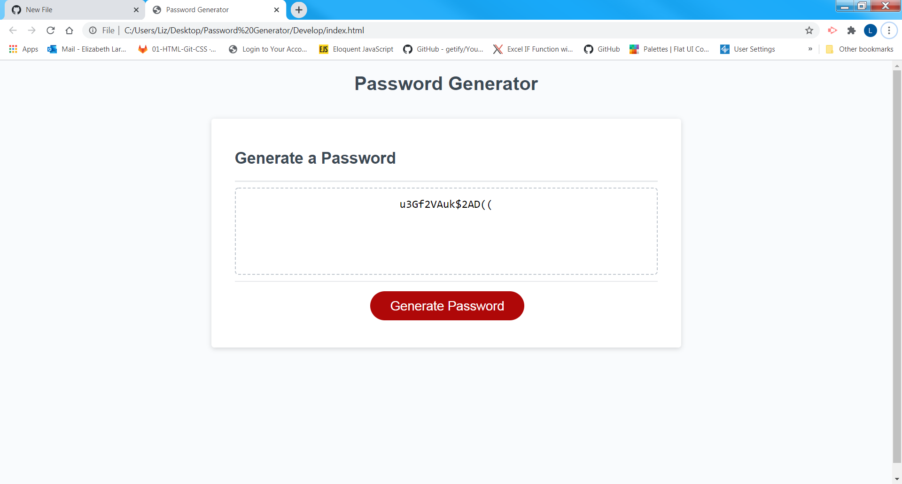

# Password_Generator
Automatically generate and display password based on user preferences

The password genertor dynamically generates and displays a password based on user criteria.
The user criteria is selected in a series of prompts and confirms. A series of conditionals
are then run to push arrays of randomized letters, numbers, or special characters to a temporary 
password. The temporary password if then made to match the character length requested by the user
and stored as the final password, which is displayed to the screen for the user.

I found that the most challenging part of this project was ensuring that passwords of any length
(especially shorter password) include all requested criteria. 

I would like to revisit this and consolidate it when I get more familar with JavaScript. I'm sure
there are significantly more concise ways of solving this challenge. 

Screenshot: 
Deployed Link: 
